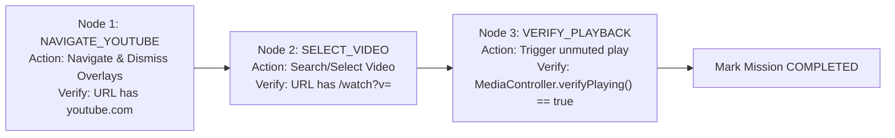

# Goal Graph & Verification Contract

## 1. The Core Invariant
**A task is NEVER marked `COMPLETED` until all goal criteria and verification predicates in its critical path have succeeded.**

In previous versions, a command such as:
> *"Open YouTube and play a random video"*

was prone to executing Step 1 (navigating to `https://www.youtube.com`), observing that the page loaded, and terminating with "Done" while the video was never selected or playing.

---

## 2. Goal Graph Architecture (`goal-graph.ts`)

A `GoalGraph` defines a directed acyclic graph (DAG) of `GoalNode`s:

```typescript
export interface GoalNode {
  id: string;
  description: string;
  action: (ctx: GoalVerificationContext) => Promise<any>;
  verification: (ctx: GoalVerificationContext) => Promise<boolean> | boolean;
  dependsOn?: string[];
  maxRetries?: number;
  retryCount?: number;
  status: 'PENDING' | 'RUNNING' | 'VERIFYING' | 'COMPLETED' | 'FAILED' | 'RETRYING';
}
```

### Lifecycle & Verification Rules
1. **Dependency Invariant**: A node CANNOT start execution until all parent nodes in `dependsOn` have achieved status `COMPLETED`.
2. **Verification Gate Invariant**: A node CANNOT transition to `COMPLETED` unless its `verification` function executes and returns `true`.
3. **Automatic Retries**: If verification fails or throws, the node transitions to `RETRYING` and re-executes with exponential backoff up to `maxRetries`.
4. **Failure Propagation**: If any node fails its retries, dependent nodes are aborted, and the graph transitions to `FAILED`.

---

## 3. Pre-built Verified Graphs

### YouTube Video Playback Graph (`GoalGraph.createYouTubePlayGraph`)



If `MediaController.verifyPlaying()` returns false (e.g. video was blocked by autoplay policy or buffering), Node 3 retries or fails the mission, reporting the exact failure reason back to the user instead of falsely declaring success.
