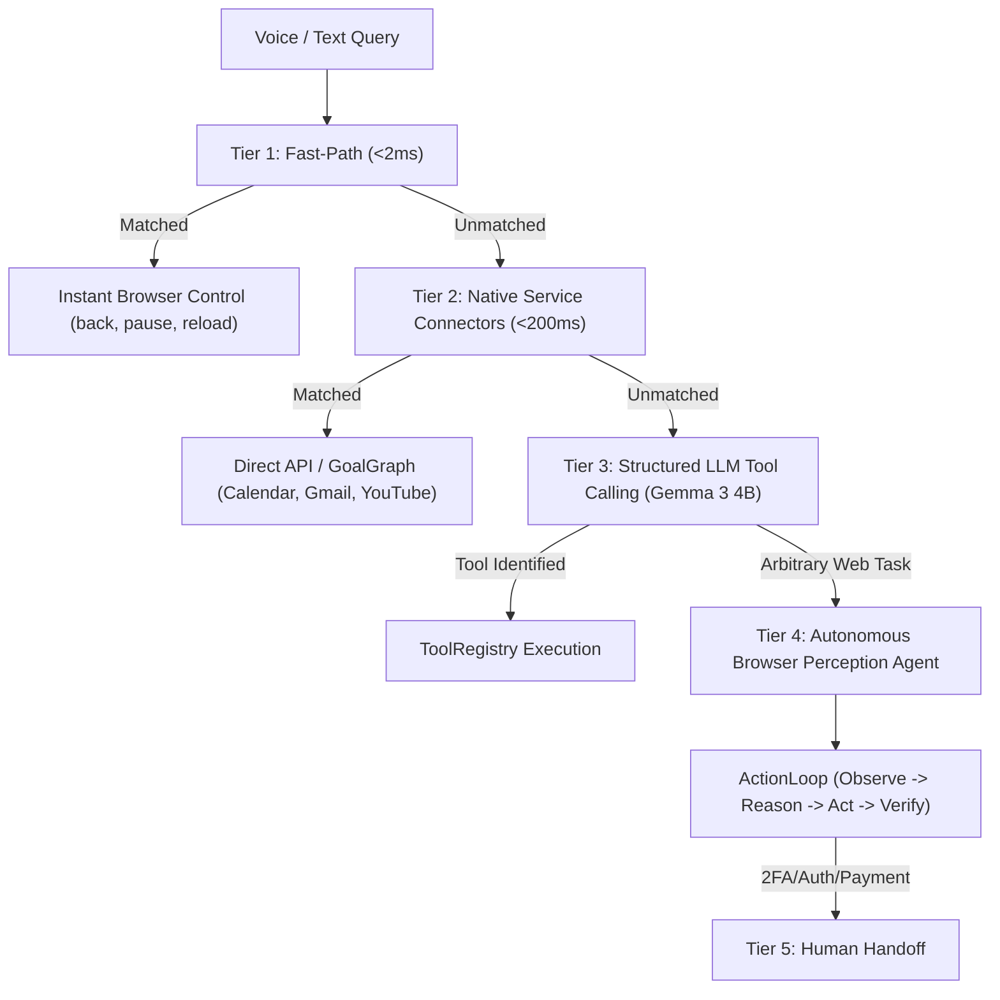

# Capability Router & Tool Priority Hierarchy

## 1. Overview
The `CapabilityRouter` (`src/agent/capability-router.ts`) is Tesseract's deterministic gateway for incoming natural language and voice requests. It prevents the system from defaulting routine queries to expensive DOM perception loops or generic Google web searches.

---

## 2. The 5-Tier Tool Hierarchy

---

## 3. Fast-Path Rules vs Native Service Routing

| User Utterance | Selected Tier | Target Action / Tool | Verification Mechanism |
| :--- | :--- | :--- | :--- |
| "Go back" | Tier 1 | `back` | Instant |
| "Pause the video" | Tier 1 | `pause` | MediaController |
| "What's my next meeting?" | Tier 2 | `calendar.today` | API response length |
| "Show my unread emails" | Tier 2 | `gmail.search` | API message array |
| "Search drive for pitch deck" | Tier 2 | `drive.search` | API file list |
| "Open YouTube and play a random video" | Tier 2 | `youtube.play` | GoalGraph with `verifyPlaying(4000)` |
| "Go to bestbuy.com and find the cheapest OLED TV" | Tier 4 | `BrowserAgent` | Live DOM tree & ActionLoop |
